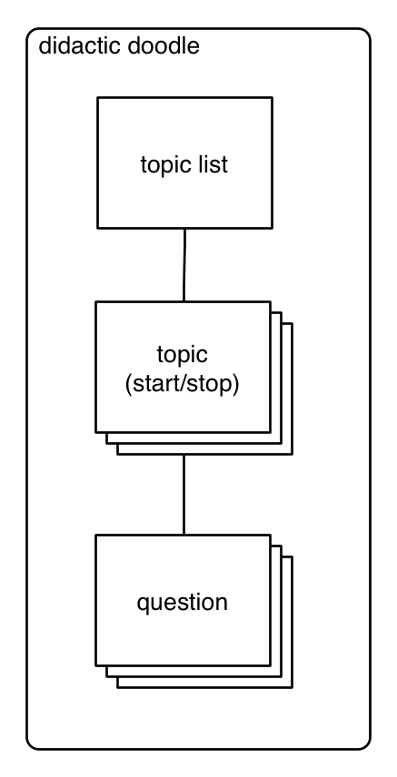

# React Redux Intermediate Class #2

This is an intermediate-level tutorial (tied in with a [Codementor.io course](https://www.codementor.io/classes)) that presumes that readers are proficient with JavaScript, have at least a passing familiarity with JavaScript 2015 syntax, and have done some basic work with React.js.

Let's build a flash card app to begin. It seems to fit with our GitHub-inspired app name, *Didactic Doodle*.

## Instructions

1. We need a back end API for our app. To save time during initial development, we'll use the wonderful [json-server](https://github.com/typicode/json-server). Let's begin by installing it:

  ```sh
  npm i -S json-server
  ```

2. Next, we'll need to add a basic DB. For `json-server`, this is just a file with a JSON object. Each key is a different collection. So in our root folder, we'll need a `db.json` file (you can name it whatever you like). We'll preload it with some test data:

  ```json
  // db.json
  {
    "topics": [
      {
        "id": 1,
        "title": "Literary Devices"
      }
    ],
    "cards": [
      {
        "id": 1,
        "topicId": 1,
        "word": "Accumulation",
        "definition": "Accumulation is derived from a Latin word which means 'pile up'. It is a stylistic device that is defined as a list of words which embody similar abstract or physical qualities or meanings with the intention to emphasize the common qualities that words hold. It is also an act of accumulating the scattered points. Accumulation examples are found in literary pieces and in daily conversations.",
        "example": "Then shall our names,<br>Familiar in his mouth as household words,<br>Harry the King, Bedford and Exeter,<br>Warwick and Talbot, Salisbury and Gloucester,<br>Be in their flowing cups freshly remembered",
        "misses": 0,
        "hits": 0
      },
      {
        "id": 2,
        "topicId": 1,
        "word": "Ballad",
        "definition": "The word Ballad is of French provenance. It is a type of poetry or verse which was basically used in dance songs in the ancient France. Later on, during the late 16th and 17th century, it spread over the majority of European nations. Owing to its popularity and emotional appeal, it remained a powerful tool for poets and lyricists to prepare music in the form of lyrical ballads and earn a handsome income from it.",
        "example": "'Day after day, day after day<br>We stuck nor breathe, nor motion;<br>As idle as a painted ship<br>Upon a painted ocean'",
        "misses": 0,
        "hits": 0
      },
      {
        "id": 3,
        "topicId": 1,
        "word": "Cacophony",
        "definition": "If we speak literally, cacophony points to a situation where there is a mixture of harsh and inharmonious sounds. In literature, however, the term refers to the use of words with sharp, harsh, hissing and unmelodious sounds primarily those of consonants to achieve desired results.",
        "example": "I detest war because cause of war is always trivial.",
        "misses": 0,
        "hits": 0
      },
      {
        "id": 4,
        "topicId": 1,
        "word": "Dactyl",
        "definition": "Dactyl is a metrical foot, or a beat in a line, containing three syllables in which first one is accented followed by second and third unaccented syllables (accented/unaccented/unaccented) in quantitative meter such as in the word 'humanly.' In dactyl, we put stress on first syllable and do not stress on second and third syllables, try to say it loud-'HU-man-ly.' Dactyl originates from a Greek word dáktylos, which means finger, because it is like bones of human fingers, beginning from central long knuckle, which is followed by two short bones.",
        "example": "<b>Half</b> a league, <b>half</b> a league,<br><b>Half</b> a league <b>on</b>ward,<br><b>All</b> in the <b>val</b>ley of <b>Death</b> <br><b>Rode</b> the six <b>hun</b>dred.<br>'<b>For</b>ward, the <b>Light</b> Brigade!<br><b>Charge</b> for the <b>guns</b>!' he said.<br><b>In</b>to the <b>val</b>ley of <b>Death</b><br><b>Rode</b> the six <b>hun</b>dred.",
        "misses": 0,
        "hits": 0
      },
      {
        "id": 5,
        "topicId": 1,
        "word": "Elegy",
        "definition": "Elegy is a form of literature which can be defined as a poem or song in the form of elegiac couplets, written in honor of someone deceased. It typically laments or mourns the death of the individual.",
        "example": "My Captain does not answer, his lips are pale and still;<br>My father does not feel my arm, he has no pulse nor will;<br>The ship is anchor’d safe and sound, its voyage closed and done;<br>From fearful trip, the victor ship, comes in with object won;<br>Exult, O shores, and ring, O bells!<br>But I, with mournful tread,<br>Walk the deck my Captain lies,<br>Fallen cold and dead.",
        "misses": 0,
        "hits": 0
      },
      {
        "id": 6,
        "topicId": 1,
        "word": "Fable",
        "definition": "The word fable is derived from a Latin word 'fibula' which means a story that is a derivative of a word 'fari' which means to speak. Fable is a literary device which can be defined as a concise and brief story intended to provide a moral lesson at the end.",
        "example": "Now, comrades, what is the nature of this life of ours? Let us face it: our lives are miserable, laborious, and short. We are born, we are given just so much food as will keep the breath in our bodies… and the very instant that our usefulness has come to an end…. No animal in England knows the meaning of happiness or leisure after he is a year old. No animal in England is free. The life of an animal is misery and slavery….",
        "misses": 0,
        "hits": 0
      },
      {
        "id": 7,
        "topicId": 1,
        "word": "Genre",
        "definition": "Genre means the type of art, literature or music characterized by a specific form, content and style. For example, literature has four main genres; poetry, drama, fiction and non-fiction. All of these genres have particular features and functions that distinguish them from one another. Hence, it is necessary on the part of readers to know which category of genre they are reading in order to understand the message it conveys, as they may have certain expectations prior to the reading concerned.",
        "example": "",
        "misses": 0,
        "hits": 0
      },
      {
        "id": 8,
        "topicId": 1,
        "word": "Haiku",
        "definition": "A haiku poem has three lines, where the first and last lines have five moras, while the middle line has seven. The pattern in Japanese genre is 5-7-5. The mora is another name of a sound unit, which is like a syllable, but it is different from a syllable. As the moras cannot be translated into English, they are modified and syllables are used instead. The lines of such poems rarely rhyme with each other.",
        "example": "Autumn moonlight-<br>a worm digs silently<br>into the chestnut.",
        "misses": 0,
        "hits": 0
      },
      {
        "id": 9,
        "topicId": 1,
        "word": "Iamb",
        "definition": "An iamb is a literary device that can be defined as a foot containing unaccented and short syllables followed by a long and accented syllable in a single line of a poem (unstressed/stressed syllables). Two of Robert Frost's poems <i>Dust of Snow</i> and <i>The Road not Taken</i> are considered two of the most popular examples of iamb.",
        "example": "Has <b>giv</b>en my <b>heart</b><br>A <b>change</b> of <b>mood</b><br>And <b>saved</b> some <b>part</b><br>Of a <b>day</b> I had <b>rued</b>.",
        "misses": 0,
        "hits": 0
      },
      {
        "id": 10,
        "topicId": 1,
        "word": "Jargon",
        "definition": "Jargon is a literary term that is defined as a use of specific phrases and words by writers in a particular situation, profession or trade. These specialized terms are used to convey hidden meanings accepted and understood in that field. Jargon examples are found in literary and non-literary pieces of writing.",
        "example": "Certain medications can cause or worsen nasal symptoms (especially congestion). These include the following: birth control pills, some drugs for high blood pressure (e.g., alpha blockers and beta blockers), antidepressants, medications for erectile dysfunction, and some medications for prostatic enlargement. If rhinitis symptoms are bothersome and one of these medications is used, ask the prescriber if the medication could be aggravating the condition.",
        "misses": 0,
        "hits": 0
      }
    ]
  }
  ```

  We have a `topics` collection with one topic so far, and an associated `cards` collection. Each card represents a flash card. It has a **word** to display on one side of the card, and both a **definition** and an **example** to display on the flip side.

3. By default, `json-server` will only nest routes one level deep. We want to go two: down to the individual card, e.g., `/topics/1/cards/3`. We can do this by adding a `routes.json` file and specifying an alias to a filtered route, thus:

  ```json
  // routes.json
  {
    "/topics/:topicId/cards/:cardId": "/cards/:cardId?topicId=:topicId"
  }
  ```

4. Now we can add a script to our `/package.json` file to start the JSON API server using the `db.json` and `routes.json` files:

  ```json
  "server": "json-server --watch db.json --routes routes.json --port 3005",
  ```

  When we run this with `npm run server`, we should be able to access the JSON API at, for example, [http://localhost:3005/topics/1/cards/3](http://localhost:3005/topics/1/cards/3). Play around with it. Pretty neat, huh? And with a REST tool such as Postman or Paws, you can do POST, PUT, DELETE, etc. requests as well.

5. We'll need a library with which to do AJAX&mdash;OK, AJAJ (Asynchronous JavaScript and **JSON**)&mdash;too. jQuery is too heavy. We don't need all that stuff. [Superagent](https://github.com/visionmedia/superagent) is very nice. But [Axios](https://github.com/mzabriskie/axios) makes better use of JS promises, so let's use that:

  ```sh
  npm i -S axios
  ```

  And let's drop some code into our `/app/components/app.jsx` file temporarily to see if things work. Add the following somewhere in `app.jsx`:

  ```jsx
  import axios from 'axios'

  axios.get('http://localhost:3005/topics/1/cards/4')
    .then((resp) => console.log(resp))
    .catch((err) => console.log(err))
  ```

  Then start the JSON API server (`npm run server`) in one terminal tab or window or pane, and the HMR WebpackDevServer (`npm start`) in another. Load the app at [http://localhost:8080/](http://localhost:8080/) and check the Dev Tools console. You should see a successful API call that returns the JSON for the Card with ID 4.

  Once you have tested it, move the above JS into a temp file&mdash;we'll need it later.

6. What we have in mind is a very simple app to show flash cards arranged by topic. We'll also track views and how many times the user got the card right (on the honor system&mdash;what's the point of cheating?). And we'll come up eventually with a clever algorithm for deciding which cards to show, when, and how often.

  Here is a basic IA diagram of our app as we currently intend to build it (we'll complicate it later, as is our wont):

  

  First thing we'll need to do is to rename our pages. We can leave the Home page alone for now, but let's change `/app/components/about.jsx` to `/app/components/topic.jsx` and add a new file (we can just copy the code across for now and change the names) in `/app/components/card.jsx`:

  ```jsx
  // app/components/topic.jsx (formerly about.jsx)
  import React from 'react'

  import { Col, Row } from 'react-bootstrap'

  const Topic = () => <Row>
    <Col xs={12}>
      <h1>Topic</h1>
    </Col>
  </Row>

  export default Topic
  ```


  ```jsx
  // app/components/topic.jsx (formerly about.jsx)
  import React from 'react'

  import { Col, Row } from 'react-bootstrap'

  const Card = () => <Row>
    <Col xs={12}>
      <h1>Card</h1>
    </Col>
  </Row>

  export default Card
  ```

  We'll also need to change the import in `/app/index.jsx` to Topic, and the routes as well:

  ```jsx
  // in app/index.jsx
  import Topic from './components/topic.jsx'
  ```

  ```jsx
  // in app/index.jsx
  <Route path='topic' component={Topic}/>
  ```

  And the link in Header (we'll worry about adding the Card route later):

  ```jsx
  // in app/components/header.jsx
  <LinkContainer to={{ pathname: '/topic' }}>
    <NavItem eventKey={2} href='#'>Topic</NavItem>
  </LinkContainer>
  ```

7. Before we move on to creating our app, let's finish setting up our actions and test our current reducer. Then we'll build on that. We'll begin by creating a button on the home page that will increment our counter. We can use a Bootstrap button and update the `/app/components/home.jsx` file like so:

  ```js
  // in app/components/home.jsx
  import { Button, Col, Row } from 'react-bootstrap'

  const Home = () => <Row>
    <Col xs={12}>
      <h1>Home</h1>
      <Button>+</Button>
    </Col>
  </Row>
  ```

8. Next, we'll want a click of the button to dispatch an `INCREMENT` action to our Redux store. We're going to use the [Flux Standard Action](https://github.com/acdlite/flux-standard-action) (FSA) pattern. To do this, we'll use [redux-actions](https://github.com/acdlite/redux-actions), so let's begin by installing that module:

  ```sh
  npm i -S redux-actions
  ```

9. At this point, we need to stop to consider how we want to structure the file system for our app. There are two common approaches. One is to group files by function: components, reducers, actions, etc. The other approach is to group by modules, so all the files associated with, say, the Topic module would go in one folder called `topic`. This includes actions, components, etc.

  The former setup is probably best for small- or medium-sized apps; the latter for large apps. As our app is fairly small, we'll go with a version of the former.

  In our app folder let's create several new folders on the same level as the components folder, and we'll move files accordingly, and we'll add some `index.js` files to allow us to simplify imports. But first, to be consistent with the way others are doing this style, we'll rename our `app` folder to `src` (for "source").

  ```sh
  mv app src
  mkdir src/components/header
  mkdir src/components/home
  touch src/components/index.js
  mkdir src/containers
  mkdir src/containers/app
  mkdir src/containers/card
  mkdir src/containers/topic
  touch src/containers/index.js
  mkdir src/helpers
  touch src/helpers/index.js
  mkdir src/redux
  mkdir src/redux/middleware
  mkdir src/redux/modules
  mkdir src/theme
  mkdir src/utils
  touch src/utils/index.js
  ```

  Next we'll rename and move a few files. As much as I like using the `.jsx` extension to indicate React components, we'll switch to plain `.js` to simplify imports.

  ```sh
  mv src/index.jsx src/client.js
  mv src/reducer.js src/redux/modules/reducer.js
  mv src/main.css src/theme/main.css
  mv src/components/app.jsx src/containers/app/app.js
  mv src/components/card.jsx src/containers/card/card.js
  mv src/components/header.jsx src/components/header/header.js
  mv src/components/home.jsx src/components/home/home.js
  mv src/components/topic.jsx src/containers/topic/topic.js
  ```

10. Next we'll need to fix our imports that are broken. Let's update our `index.js` files to make importing components, etc. a little easier. In `/src/components/index.js` put:

  ```js
  export { default as Header } from './header/header'
  export { default as Home } from './home/home'
  ```

  In `/src/containers/index.js` put:

  ```js
  export { default as App } from './app/app'
  export { default as Card } from './card/card'
  export { default as Topic } from './topic/topic'
  ```

  In `/src/containers/app/app.js` change `import Header from './header.jsx'` to:

  ```js
  import { Header } from '../../components'
  ```

  See how this is going to work? The `index.js` file becomes a kind of shortcut to the individual components. Now in `/src/client.js` change this:

  ```js
  // THIS IS THE OLD VERSION
  import './main.css'

  import App from './components/app.jsx'
  import Home from './components/home.jsx'
  import About from './components/about.jsx'

  import reducer from './reducer.js'
  ```

  to this:

  ```js
  import './theme/main.css'

  import { Home } from './components'
  import { App, Topic } from './containers'

  import reducer from './redux/modules/reducer'
  ```

  It's a bit nicer, isn't it? We'll clean this up still more later.

11. We also need to fix our `webpack.config.babel.js` file. Change this:

  ```js
  // THIS IS THE OLD VERSION
  entry: {
    app: PATHS.app
  },
  ```

  to this:

  ```js
  entry: {
    main: './app/client.js'
  },
  ```

  Also, we need to update our PATHS. Change `app` to `src` everywhere except as the name of the build bundle. To make it clear, here's the entire updated `webpack.config.babel.js` file:

  ```js
  import webpack from 'webpack'
  import path from 'path'
  import merge from 'webpack-merge'
  import stylelint from 'stylelint'

  const TARGET = process.env.npm_lifecycle_event

  process.env.BABEL_ENV = TARGET

  const PATHS = {
    src: path.join(__dirname, 'src'),
    build: path.join(__dirname, 'build')
  }

  const common = {
    entry: {
      main: './src/client.js'
    },
    resolve: {
      extensions: [ '', '.js', '.jsx' ]
    },
    output: {
      path: PATHS.build,
      filename: 'app.js'
    },
    externals: {
      'jsdom': 'window',
      'react/lib/ReactContext': 'window',
      'react/lib/ExecutionEnvironment': true,
      'react/addons': true
    },
    module: {
      preLoaders: [
        {
          test: /\.css$/,
          loaders: [ 'postcss' ],
          include: PATHS.src
        },
        {
          test: /\.jsx?$/,
          loaders: [ 'eslint' ],
          include: PATHS.src
        }
      ],
      loaders: [
        {
          test: /\.css$/,
          loaders: [ 'style', 'css', 'myth' ],
          include: PATHS.src
        },
        {
          test: /\.jsx?$/,
          loaders: [ 'babel?cacheDirectory' ],
          include: PATHS.src
        }
      ]
    },
    postcss: function () {
      return [stylelint({
        rules: {
          'color-hex-case': 'lower'
        }
      })]
    }
  }

  const startConfig = {
    devtool: 'eval-source-map',
    devServer: {
      contentBase: PATHS.build,
      historyApiFallback: true,
      hot: true,
      inline: true,
      progress: true,
      stats: 'errors-only',
      host: process.env.HOST,
      port: process.env.PORT
    },
    plugins: [
      new webpack.HotModuleReplacementPlugin()
    ]
  }

  const buildConfig = {}

  const config = (TARGET === 'start' || !TARGET)
    ? merge(common, startConfig)
    : merge(common, buildConfig)

  export default config
  ```
